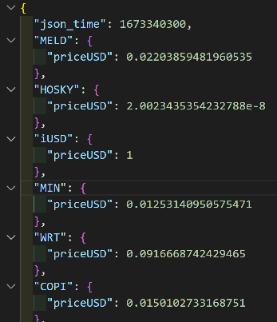

# Meld

## What is it, how it works

To run the risk simulation for MELD, you have to run two things:

0. A javascript backend to fetch data from the Cardano blockchain, from MELD itself (user data) and compute some liquidity/slippage values
1. A python script to run the simulation, using data generated/formatted by the javascript backend

## Javascript backend

The javascript backend is composed of few script that are run sequentially:

1. MinSwapFetcher.js
1. WingridersLiquidityFetcher.js
1. SlippageParser.js
1. UserDataTranslator.js
   
All these scripts are run by the MeldWorker.js

### MinswapFetcher

This script has three goals:

#### 1/ Fetch 3 months of price history for each tokens allowed in the MELD protocol

Using the minswap blockfrost API, it will get all trades from now to 3 months ago for each {token}/ADA pools

All the results are saved as csv in a `history-src` directory:

The csv are needed by the simulation, it reads it from here so they should not be moved/deleted

Also, because of the blockfrost API limitation and because it takes a lot of time: each time the script is started, before fetching new trades the script reads the old ones so it can only fetch the new ones.

On the first launch, without any csv to read from, the script will have to fetch the history for 3 months.

It is not possible with a free Blockfrost API in one run. It must be done in 2 or 3 days (starting the script, stopping it when the api limit is reached, restarting after etc...).

#### 2/ Save the minswap pools reserves

Creates a `./liquidity/minswap_liquidity.json` file that list the reserves for each pools:

#### 3/ Generate a dex_price.json file

From the last results, creates a `./liquidity/dex_price.json` file:

### WingridersLiquidityFetcher

Using the blockfrost API, it will get the reserve values from the DEX Wingriders.

The file is saved here: `./liquidity/wingriders_liquidity.json`

### SlippageParser

This script has two goals:

1. it aggregates the liquidities from Minswap and Wingriders
2. it generates a `./liquidity/usd_volume_for_slippage.json` file which is the volume of each tokens for 10% slippage

### UserDataTranslator

This script transforms the data from MELD (TODO: HOW WILL MELD SEND US THE FILE ?) into the correct format needed by the simulation

The script will generate a `./user-data/data.json` file that will be read by the python script

### Steps to run the data fetch and simulation

1. Have a Blockfrost api key
1. Run the javascript backend
1. Run the python simulation

## Blockfrost API Key

To run the javascript backend, you need a Blockfrost api key [that you can get here for free](https://blockfrost.io/)

You must set it to your environment variable: `BLOCKFROST_PROJECTID`

## Run the Javascript backend

install required packages: `npm install`

Go to the meld directory (`cd ./meld`), run the MeldWorker using the following command: `node MeldWorker.js`

## Run the python simulation

install required packages: `pip install -r requirements.txt`

Go to the simulations directory  (`cd ./simulations`)
 
run the python script:
- In fast mode: `python runner_meld.py 1`
- In normal mode: `python runner_meld.py`